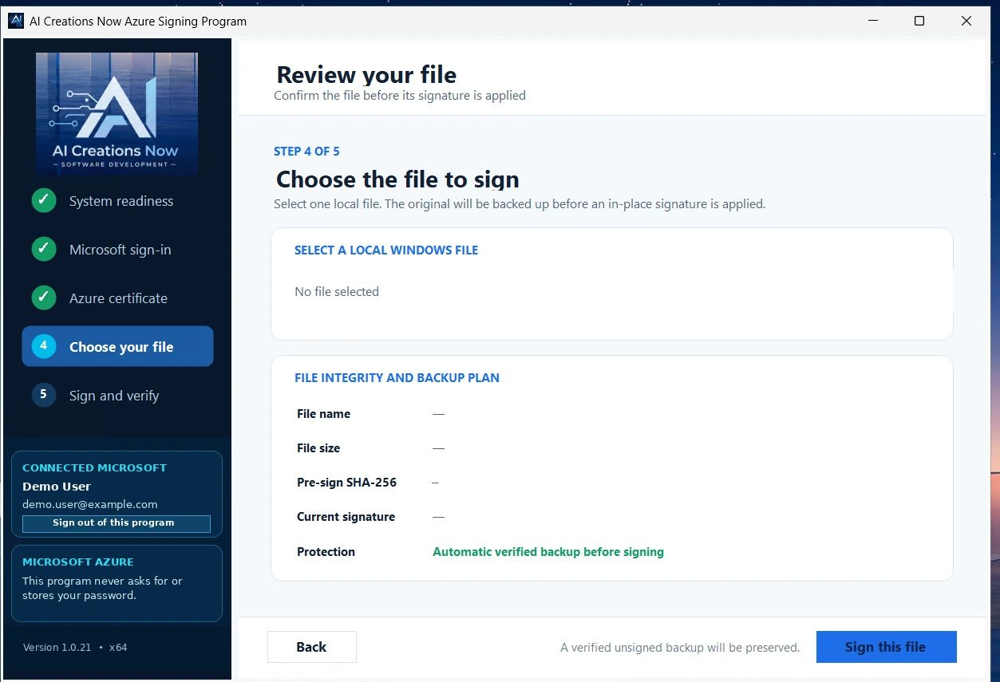

# Azure Artifact Signing Tool: signing workflow and questions

## Sign and verify a Windows release

1. Download the portable tool from the [official product page](https://aicreatenow.com/azuretool.html). You need an existing eligible Microsoft Azure subscription, Artifact Signing account, active certificate profile and signing permission.
2. Open the application as Administrator and review the Microsoft prerequisite checks.
3. Sign in through Microsoft, then choose the subscription, signing account and certificate profile associated with your account.
4. Select the file or batch you intend to release. The tool creates and hash-verifies an unsigned recovery backup before changing each file.
5. Complete signing and inspect the Authenticode verification results. Keep the recovery copy until you have checked the finished release.

## Single-file and batch signing

| Workflow | Files | Output to review |
| --- | ---: | --- |
| Single file | 1 | Signed file, verification results and local three-page PDF |
| Batch | 2–50 | Signed files and verification results; no PDF report |

This official screenshot shows version 1.0.21's single-file selection screen with demonstration data. The published 1.0.23 release supports batches of up to 50 files. The image is a workflow illustration, not a current-version capture.

## Common questions

**Does the free tool include an Azure certificate?** No. Microsoft account eligibility, identity validation, signing resources, roles and service charges are separate.

**Where are my files and reports?** The selected files, recovery backups, hashes and reports are handled locally. Microsoft authentication and signing require internet access.

**Why is there no PDF for my batch?** PDF generation applies only when one file is signed. Sign a release file individually when you need its PDF verification report.

**How do I leave a shared computer?** Use **Sign out of this program** to remove the application's saved authorization. This control does not sign out unrelated browser sessions.

[Back to product overview](README.md) · [Support](SUPPORT.md)
