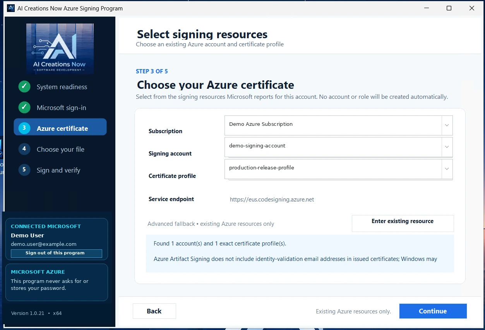
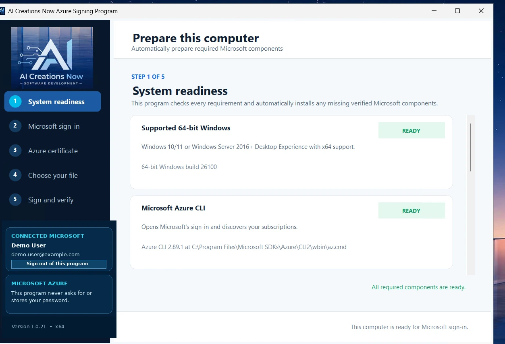

  

<h1 align="center">Azure Artifact Signing Tool</h1>

A free, portable Windows application from **AI Creations Now Software Development** for customers who already use Microsoft Azure Artifact Signing. Prepare the required Microsoft components, connect to your signing resources, and sign and verify one file or a batch of up to 50 files through a guided interface.

  <a href="https://aicreatenow.com/azuretool.html">Official product page</a> · <a href="https://download.aicreatenow.com/software/AI_Creations_Now_Azure_Signing_Program_1_012.exe">Download for Windows</a> · <a href="https://download.aicreatenow.com/media/aicreatenow/azuretool4k.mp4">Video walkthrough</a>

  

## Features

- Detect existing Microsoft prerequisites and prepare missing or unusable components.
- Sign in through Microsoft's browser authentication and select your Azure subscription, signing account, and certificate profile.
- Sign one file or a batch of up to 50 files.
- Create and hash-verify an unsigned recovery backup before changing a selected file.
- Apply Microsoft Artifact Signing and a Microsoft timestamp, then validate the resulting Windows Authenticode signatures.
- Generate a local, three-page verification PDF when signing a **single file**, including before-and-after SHA-256 hashes, certificate and timestamp details, and recovery locations. Batches of 2–50 files do not generate a PDF.
- Retain the application's protected Azure CLI session for the current Windows account, with an explicit **Sign out of this program** control.

  

**Published version: 1.0.23.** The screenshots and video show an earlier release with demonstration data. Version 1.0.23 adds batch signing while retaining PDF reports for single-file signing.

## Requirements

- 64-bit Windows 10, Windows 11, or Windows Server with Desktop Experience.
- Local administrator access to prepare prerequisites.
- An eligible paid Microsoft Azure subscription, an existing Artifact Signing account, an active certificate profile, and permission to sign with it.
- Internet access for Microsoft authentication, component setup, signing, and timestamping.

The application checks or prepares Azure CLI, the .NET 8 x64 Runtime, the Visual C++ x64 Runtime, Artifact Signing Client Tools, Windows SDK Signing Tools, and the Azure Artifact Signing extension. Microsoft components may remain installed after the portable application is removed.

The tool does not create your Azure subscription, complete Microsoft's identity validation, or automatically create a certificate profile or role assignment. Microsoft's service requirements and charges are separate from this free application.

## Download and use

1. Download the portable executable from the [official download host](https://download.aicreatenow.com/software/AI_Creations_Now_Azure_Signing_Program_1_012.exe).
2. Run the application as Administrator and review the prerequisite preparation it proposes.
3. Authenticate with Microsoft and select your existing signing resources.
4. Select one file or a batch, then follow the backup, signing, and verification steps.
5. Review the verification results and, for a single file, the generated PDF.

There is no product installer, product subscription, license code, or required payment. The website's download panel opens an optional Stripe contribution tab; you can close that tab and return to the free download. [Optional contributions of $3 or more](https://buy.stripe.com/6oUeVf77ZdRCfMEbka5kk04) support development.

## Privacy and account handling

Selected file contents are not uploaded to AI Creations Now. Files, backups, hashes, and reports are handled locally; the application communicates with Microsoft for authentication and signing. Microsoft handles password and MFA entry. The application can retain its own authorization cache without changing your ordinary Azure CLI profile.

Use the application's sign-out control before leaving a shared or temporary computer. Signing a file does not guarantee acceptance by SmartScreen, antivirus software, or an app store.

## Support

Contact [info@aicreatenow.com](mailto:info@aicreatenow.com) or call **1-866-315-4750**. See the [product page](https://aicreatenow.com/azuretool.html) for current release information and the [software catalog](https://aicreatenow.com/software.html) for AI Creations Now's product support information.

## Source and licensing

This repository contains documentation for proprietary software. Application source code is not included. Obtain the application and its applicable terms through the official product page.
